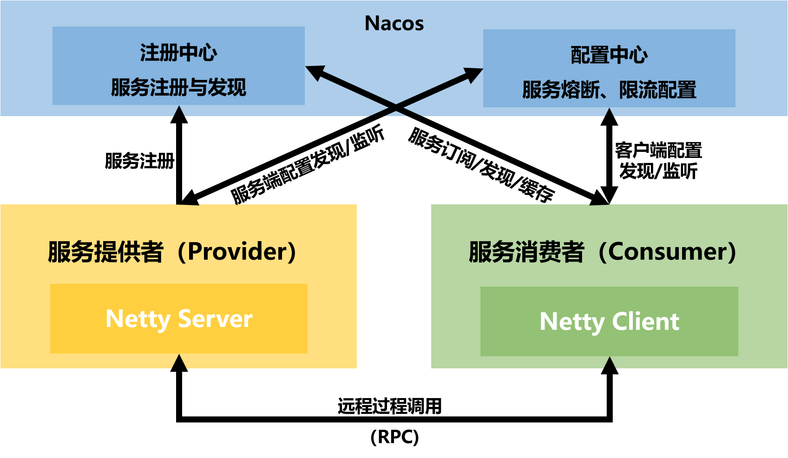

# my-rpc-framework - 轻量级高性能RPC框架

[](https://www.oracle.com/java/technologies/javase-downloads.html)
[](https://netty.io/)
[](https://nacos.io/)
[](https://jenkov.com/tutorials/java-performance/jmh.html)
[](https://www.apache.org/licenses/LICENSE-2.0)

## 📖 项目介绍

**my-rpc-framework** 是一款从零开始手写的轻量级RPC框架，参考Dubbo的设计思想，旨在解决分布式服务之间的远程通信问题。框架实现了服务注册发现、网络通信、序列化、负载均衡、熔断、限流等核心功能。

### 为什么写这个项目？
- 深入理解RPC原理，从实践层面掌握Netty、Nacos等主流技术
- 学习优秀框架的设计思想（SPI扩展、服务治理等）
- 为后续学习Dubbo、gRPC等工业级框架打下基础

## ✨ 核心特性

- **高性能网络通信**：基于 Netty 的 Reactor 主从多线程模型，自定义二进制协议，解决TCP粘包拆包问题
- **服务治理**：集成 Nacos 实现服务的自动注册与发现，本地缓存+监听器机制保障性能和可用性
- **动态配置中心**：集成 Nacos 配置中心，支持服务治理规则（限流阈值、熔断参数）的**动态下发与实时生效**，配置变更无需重启
- **服务熔断与限流**：服务端和客户端双维度限流熔断保护，支持令牌桶限流算法和状态机熔断器（关闭→开启→半开），有效防止雪崩效应
- **多序列化支持**：基于SPI插件化架构，支持Kryo（默认）、Hessian（跨语言）、Java原生（用于对比）动态切换
- **负载均衡**：提供随机、轮询、一致性哈希（虚拟节点）三种策略，基于 SPI 架构支持扩展
- **易用性**：基于JDK动态代理，对业务代码无侵入；提供Spring Boot Starter（待实现），注解驱动

## 🏗️ 整体架构

### 模块说明
```
my-rpc-framework/
├── rpc-api               # 服务接口定义
├── rpc-common            # 通用工具类、实体类
├── rpc-core              # 核心实现（网络、序列化、注册发现、服务订阅、服务端和客户端的熔断降级、限流）
├── rpc-provider          # 服务提供者示例
├── rpc-consumer          # 服务消费者示例
└── rpc-spring-boot-starter # Spring Boot自动配置（待实现）
```
## ⚡ 性能测试

### 与 Apache Dubbo 的对比

我们在相同硬件环境（`Intel i5-12400F, 16GB`）下，使用 `JMH` 对 `my-rpc-framework`（自定义`TCP`协议+`Kory`序列化） 和 `Apache Dubbo 3.2.0` (`Triple`协议) 进行了对比测试。

| 测试场景 | 指标 |   Dubbo    | my-rpc-framework | 对比 |
|:---|:---|:----------:|:----------------:|:---:|
| 简单字符串返回 | 吞吐量 | 7.0K ops/s | **13.1K ops/s**  | **+87%** |
| | TP99延迟 |  0.323ms   |   **0.130ms**    | 快 2.5倍 |
| 对象返回 | 吞吐量 | 7.2K ops/s | **12.8K ops/s**  | **+78%** |
| | TP99延迟 |  0.321ms   |   **0.128ms**    | 快 2.5倍 |
| 列表返回 | 吞吐量 | 6.7K ops/s | **12.0K ops/s**  | **+79%** |
| | TP99延迟 |  0.362ms   |   **0.136ms**    | 快 2.7倍 |

**测试结论**：
- my-rpc-framework 在测试场景下吞吐量达到 Dubbo 的 **1.8倍**
- 99分位延迟仅为 Dubbo 的 **40%**
- 并发扩展性更好，8线程下仍保持线性增长

> 注：Dubbo 作为企业级框架，包含更丰富的服务治理功能，本测试仅对比核心RPC通信性能。测试代码完全开源，欢迎复现验证。

## 🔧 技术选型

| 技术      | 版本      | 用途      |
|---------|---------|---------|
| Netty   | 4.1.68  | 底层网络通信  |
| Nacos   | 2.2.3   | 服务注册发现 + **配置中心** |
| Kryo    | 5.2.0   | Java序列化 |
| Hessian | 4.0.66  | 跨语言序列化  |
| JMH     | 1.36    | 微基准测试框架 |
| SLF4J   | 2.0.13  | 日志门面    |
| Lombok  | 1.18.42 | 简化代码    |
| JUnit   | 5.9.2   | 单元测试    |


## 🎯 项目亮点与难点

### 1. 网络层优化
**难点**：TCP粘包拆包、Netty线程模型设计
**解决方案**：
- 自定义协议头（魔数+版本+类型+序列化+消息ID+长度），配合`LengthFieldBasedFrameDecoder`精准切包
- IO线程与业务线程分离，避免反射调用阻塞EventLoop

### 2. 服务发现性能优化
**难点**：每次调用都查询Nacos导致性能瓶颈
**解决方案**：
- 本地缓存服务列表（30秒过期）
- 基于Nacos监听机制实时更新缓存
- 注册中心故障时允许使用过期缓存

### 3. 可扩展性设计
**难点**：如何支持多种序列化方式、负载均衡策略的动态切换
**解决方案**：
- 实现SPI插件化架构
- 新增实现类只需在`META-INF/services`配置即可生效

### 4. 配置中心动态更新
**难点**：如何在运行时动态调整限流熔断参数，且不影响正在进行的调用

**解决方案**：
- 基于 Nacos 的 `ConfigService` 实现配置的拉取和监听
- 自定义 YAML 配置结构，支持服务级和方法级的精细配置
- 使用 **Watch Dog 机制**监听配置变更，变更后实时更新内存中的治理规则
- 实现配置的**版本管理和回滚能力**（利用 Nacos 原生能力）

### 5. 全链路服务治理
**难点**：如何在不侵入业务代码的前提下，实现服务端和客户端的双维度保护

**解决方案**：
- 服务端：在 `NettyServerHandler` 中植入熔断限流检查，保护后端服务
- 客户端：在 `ClientProxy` 动态代理中植入治理逻辑，保护调用方自身
- 统一的异常体系：`FlowLimitException`、`CircuitBreakerException` 等，便于调用方识别和处理
- 支持**降级策略**：开发者可注册降级函数，在熔断/限流时返回默认值


## 🚀 快速开始

### 环境要求
- JDK 21+
- Nacos 2.2.3+（[快速启动Nacos](https://nacos.io/zh-cn/docs/quick-start.html)）
- Maven 3.6+

### 1. 启动Nacos服务器

```bash
# 使用Docker启动（推荐）
docker run -d --name nacos -p 8848:8848 -p 9848:9848 -e MODE=standalone nacos/nacos-server:latest

# 或直接下载运行
sh startup.sh -m standalone
```

### 2. 定义服务接口

```java
// 在rpc-api模块中
public interface HelloService {
    String sayHello(String name);
    String sayHello(String name, int age);
}
```

### 3. 实现服务提供者

```java
// rpc-provider模块
@Slf4j
public class HelloServiceImpl implements HelloService {
    @Override
    public String sayHello(String name) {
        return "Hello, " + name;
    }
    
    @Override
    public String sayHello(String name, int age) {
        return String.format("Hello, %s! You are %d years old.", name, age);
    }
}

// 启动服务端
public class ProviderApplication {
    public static void main(String[] args) {
        NettyServer server = new NettyServer("127.0.0.1", 8080);
        server.registerService(HelloService.class.getName(), new HelloServiceImpl());
        
        // 注册到Nacos
        NacosServiceRegistry registry = new NacosServiceRegistry("127.0.0.1:8848");
        registry.registerService(HelloService.class.getName(), "127.0.0.1", 8080);
        
        server.start();
    }
}
```

### 4. 调用服务消费者

```java
// rpc-consumer模块
@Slf4j
public class ConsumerApplication {
    public static void main(String[] args) {
        // 创建代理
        NacosServiceDiscovery discovery = new NacosServiceDiscovery("127.0.0.1:8848");
        ClientProxy proxy = new ClientProxy(MessageConstants.SERIALIZER_KRYO, discovery);
        HelloService helloService = proxy.getProxy(HelloService.class);
        
        // 像调用本地方法一样调用远程服务
        String result = helloService.sayHello("World");
        log.info("调用结果：{}", result);
    }
}
```

### 5. 配置动态更新（可选）

my-rpc-framework 支持通过 Nacos 配置中心动态调整服务治理规则，配置变更后**无需重启服务**即可生效。

#### 5.1 在 Nacos 中创建配置

登录 Nacos 控制台 (http://localhost:8848/nacos)，创建配置：

- **Data ID**: `service-rules.yaml`
- **Group**: `DEFAULT_GROUP`
- **配置格式**: YAML

```yaml
# 在Nacos中：dataId=service-rules.yaml
services:
  - serviceName: "site.elseif.myRpcFramework.api.HelloService"
    # 服务端治理规则
    provider:
      group: "CORE"
      methods:
        - name: "sayHello"
          flowLimitQps: 1000
          circuitBreaker:
            failureThreshold: 5
            timeoutMs: 10000
            halfOpenSuccess: 30
      defaultMethodConfig:
    # 消费者端治理规则
    consumer:
      methods:
        - name: "sayHello"
          # 消费者QPS限流
          flowLimitQps: 500
          # 熔断配置
          circuitBreaker:
            failureThreshold: 5
            timeoutMs: 5000
            halfOpenSuccess: 30
```

#### 5.2 服务端启动配置中心
```yaml
// 在 ProviderApplication 中启用配置中心
@Slf4j
public class ProviderApplication {
    public static void main(String[] args) {
        String serverIp = "127.0.0.1";
        int serverPort = 8845;
        
        // 1. 创建服务器实例
        NettyServer server = new NettyServer(serverIp, serverPort, MessageConstants.SERIALIZER_KRYO);
        log.info("服务提供者启动，监听地址：");
        
        // 2. 创建服务实现类
        HelloService helloService = new HelloServiceImpl();
        
        // 3. 本地注册服务
        server.registerService(HelloService.class.getName(), helloService);
        
        // 启用Nacos配置中心，自动拉取并监听配置变更
        server.enableNacosConfig("127.0.0.1:8848");
        
        // 4. Nacos 注册服务
        serviceRegistry.registerService("site.elseif.myRpcFramework.api.HelloService", serverIp, serverPort);
        
        server.start();
  
        // 5. Nacos 注销服务
        serviceRegistry.deregisterService("site.elseif.myRpcFramework.api.HelloService", serverIp, serverPort);
    }
}
```
#### 5.3 客户端启动配置中心
```yaml
// 在 ConsumerApplication 中启用配置中心
public class ConsumerApplication {
public static void main(String[] args) {
NacosServiceDiscovery discovery = new NacosServiceDiscovery("127.0.0.1:8848");

        NacosListenerServiceDiscovery serviceDiscovery = new NacosListenerServiceDiscovery("127.0.0.1:8848", "public");
        
        // 创建代理时自动从配置中心加载治理规则
        ClientProxy proxy = new ClientProxy(MessageConstants.SERIALIZER_KRYO, discovery);
        
        proxy.enableNacosConfig("127.0.0.1:8848", "service-rules.yaml", "DEFAULT_GROUP");
        
        HelloService helloService = proxy.getProxy(HelloService.class);
        
        // 运行时动态调整：在Nacos控制台修改配置，限流阈值即时生效！
        for (int i = 0; i < 100; i++) {
            try {
                String result = helloService.sayHello("World");
                log.info("调用结果：{}", result);
            } catch (FlowLimitException e) {
                log.warn("触发限流：{}", e.getMessage());
            } catch (CircuitBreakerException e) {
                log.warn("触发熔断：{}", e.getMessage());
            }
            Thread.sleep(100);
        }
    }
}
```

## 📈 后续规划

- [x] 增加熔断降级机制
- [x] 增加限流机制
- [x] 集成 Nacos 配置中心，实现动态规则更新
- [ ] 支持异步调用（CompletableFuture）
- [ ] 集成 OpenTelemetry 实现链路追踪
- [ ] 增加泛化调用支持
- [x] 实现更多的负载均衡策略（轮询、一致性哈希虚拟节点）

## 更新日志：
- 添加RPC编码器，消息体最大消息长度限制，超过限制无法发送请求，保护服务器
- 添加熔断器尝试半开状态失败，指数退避机制，避免频繁尝试导致雪崩
- 添加服务发现，新特性：PersistentServiceDiscovery，基于缓存、Nacos订阅监听和磁盘持久化的三级服务发现机制，提升服务发现可靠性

## 🤝 如何贡献

欢迎提交Issue和PR！如果你想贡献代码：

1. Fork本项目
2. 创建特性分支 (`git checkout -b feature/AmazingFeature`)
3. 提交改动 (`git commit -m 'Add some feature'`)
4. 推送到分支 (`git push origin feature/AmazingFeature`)
5. 提交Pull Request

## 📄 License

本项目基于 Apache License 2.0 协议。

## 📧 联系我

- 邮箱: wuyong@njust.edu.cn

如果这个项目对你有帮助，欢迎Star⭐️！

